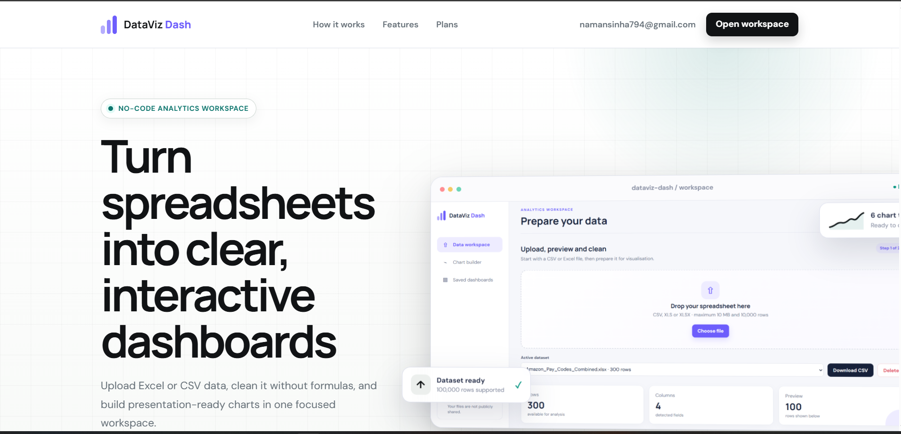

# DataViz Dash

> Turn spreadsheets into clean, interactive dashboards without writing code.

[](https://dataviz-dash.onrender.com/)


DataViz Dash is a no-code spreadsheet analytics workspace created by
**[Naman Sinha](https://github.com/Naman794)**. Upload CSV or Excel files,
prepare the data, build multi-page dashboards, and export presentation-ready
results from one focused browser workspace.

## Try it live

**Public URL:** [https://dataviz-dash.onrender.com/](https://dataviz-dash.onrender.com/)

**Documentation:** [https://dataviz-dash.onrender.com/docs](https://dataviz-dash.onrender.com/docs)

Create an account or use the available workspace to explore the complete upload,
cleaning, visual-builder, dashboard, and export flow. The service is hosted on
Render, so the first request may take a little longer if the free instance has
been idle.

## Product preview

### 1. Landing page

The public landing page explains the workflow, feature set, and available plans.



### 2. Inside the app

Upload CSV, XLS, or XLSX data, retain the original filename, switch datasets
instantly, inspect rows and columns, apply cleaning rules, and download the
prepared data.


### 3. Builder area

Use the expanded Power BI-inspired canvas, contextual inspector, sheet-style
page tabs, zoom controls, and drag-and-resize grid to create reusable dashboards.


## Latest release — v0.2.1

Version **v0.2.1** expands the original MVP into a broader dashboard workspace:

- One-click sample dataset and ready-made dashboard for first-time visitors
- Deployment health and version endpoints for release monitoring
- Privacy-safe public product screenshots
- Redesigned graphite interface with a larger, presentation-oriented canvas
- Dedicated builder with Data, Build, and Format inspector views
- Sheet-style multi-page dashboards
- Drag-and-resize visuals on a persisted 12-column grid
- Fit page, Fit width, Actual size, focus, zoom, grid, undo, and redo controls
- KPI cards, data tables, and eight chart/visual types
- Instant dataset switching without an extra open action
- Automatic preservation of uploaded filenames
- Field profiling, date grouping, sorting, Top-N, duplication, and formatting
- Account-backed datasets, dashboards, usage reporting, and admin controls
- Server-enforced Free and Pro capacity entitlements with a six-tier commercial roadmap
- Expanded Free capacity and a 5 GB total-upload allowance for Pro accounts

## Core capabilities

- CSV, XLS, and XLSX upload and preview
- Column renaming and removal
- Missing-value replacement or incomplete-row deletion
- Duplicate and completely empty-row removal
- Cleaned CSV download
- Bar, line, area, pie, scatter, histogram, KPI, and table visuals
- Multi-visual, multi-page dashboard creation and persistence
- Per-visual sorting, Top-N limits, editing, duplication, and responsive sizing
- Month, quarter, and year grouping for date-based visuals
- Chart PNG, dashboard JSON, and print-ready PDF exports
- Anonymous browser-isolated workspaces
- Email/password and Google accounts with persistent workspace ownership
- Protected administrator console with activity and access controls
- Responsive layouts for desktop and smaller screens

## Product flow

1. Try the bundled sample dashboard or upload your own spreadsheet.
2. Apply cleaning rules to prepare the dataset for analysis.
3. Open the builder and choose fields, aggregations, and visual types.
4. Arrange visuals across one or more sheet-style dashboard pages.
5. Save the dashboard for future access or export.

## Pricing models

DataViz Dash now has a six-level India-focused commercial ladder:

| Plan | Positioning | Price |
| --- | --- | ---: |
| Free | Individual experimentation | ₹0 |
| Pro | Freelancer / analyst | ₹499/month |
| Business | Teams + larger usage | ₹1,999–₹2,999/month |
| Agency | Multiple clients/workspaces | ₹4,999–₹9,999/month |
| Enterprise | SSO, private deployment, SLA | Custom |
| Government | Private/on-prem deployment + support | Custom annual contract |

Free and Pro are the current technical entitlement levels. Pro checkout remains
disabled while billing is being integrated. Business, Agency, Enterprise, and
Government are staged commercial packages; their collaboration, workspace,
SSO, deployment, and SLA capabilities must be delivered before they are sold.

### Current enforced capacity

| Capability | Free | Pro |
| --- | ---: | ---: |
| Maximum upload per file | 50 MB | 100 MB |
| Rows per dataset | 100,000 | 100,000 |
| Total uploaded source data | 150 MB | 5 GB |
| Saved datasets | 3 | 25 |
| Saved dashboards | 2 | 25 |
| Visuals per dashboard | 4 total | 12 total |
| Pages per dashboard | 1 | 20 |
| Chart data processed | 50,000 rows | 100,000 rows |
| Basic data cleaning | Included | Included |
| Cleaned CSV and chart PNG export | Included | Included |
| Dashboard JSON and print/PDF export | Upgrade required | Included |

The **5 GB Pro allowance is total account storage measured from original upload
sizes**. It is not a 5 GB single-file limit; individual Pro uploads remain capped
at 100 MB for safe synchronous processing in the current Flask and Pandas
architecture.

## Technology

| Layer | Technology |
| --- | --- |
| Application | Python and Flask |
| Data processing | Pandas, OpenPyXL, and xlrd |
| Database | MongoDB and PyMongo |
| Visualisation | Plotly.js |
| Interface | HTML, CSS, and JavaScript |
| Quality | Pytest, Ruff, and GitHub Actions |
| Packaging | Docker and GitHub Container Registry workflow-ready |
| Hosting | Render |

## Google sign-in configuration

Create a Google OAuth client with application type **Web application**.

Authorized JavaScript origins:

- `https://dataviz-dash.onrender.com`
- `http://localhost:5000`

Authorized redirect URIs:

- `https://dataviz-dash.onrender.com/account/google/callback`
- `http://localhost:5000/account/google/callback`

Set these environment variables in Render rather than committing credentials:

```env
GOOGLE_CLIENT_ID=your-google-client-id
GOOGLE_CLIENT_SECRET=your-google-client-secret
GOOGLE_REDIRECT_URI=https://dataviz-dash.onrender.com/account/google/callback
SESSION_COOKIE_SECURE=true
```

The OAuth request uses only `openid email profile`. Verified Google emails can
create a new account or link an existing account with the same email. OAuth
tokens are not stored.

## Privacy and access

- Uploaded datasets are never given public share links.
- Anonymous data is isolated through a signed browser workspace identifier.
- Registered users can claim an anonymous workspace and access it after signing in.
- Passwords are stored as secure hashes rather than plaintext.
- Google sign-in validates the OpenID Connect response and requires a verified email.
- Plan limits are enforced by the server rather than only hidden in the interface.
- Administrative membership and suspension changes are written to an audit trail.

## Project status

DataViz Dash is under active development. Version **v0.1** established the
data-cleaning and dashboard MVP. Version **v0.2.1** adds the expanded builder,
multi-page dashboards, instant dataset switching, refreshed UI, account usage,
and the revised capacity and six-tier pricing model.

See the [release history](https://github.com/Naman794/DataViz-Dash/releases) and
the [freemium product plan](docs/FREEMIUM_PLAN.md).

## Creator

**DataViz Dash was designed and built by [Naman Sinha](https://github.com/Naman794).**

## License

Licensed under the [Apache License 2.0](LICENSE).
