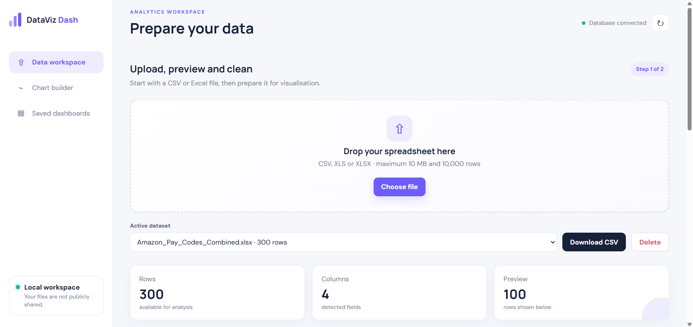
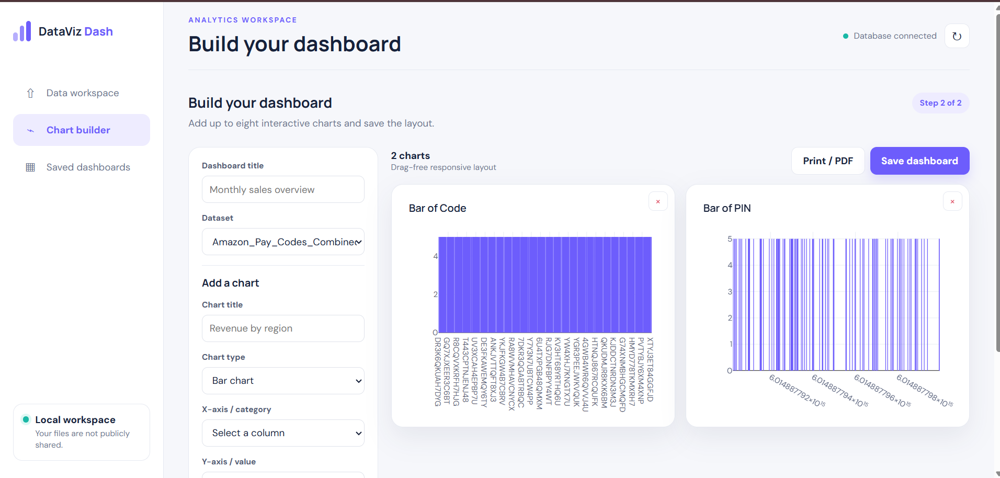
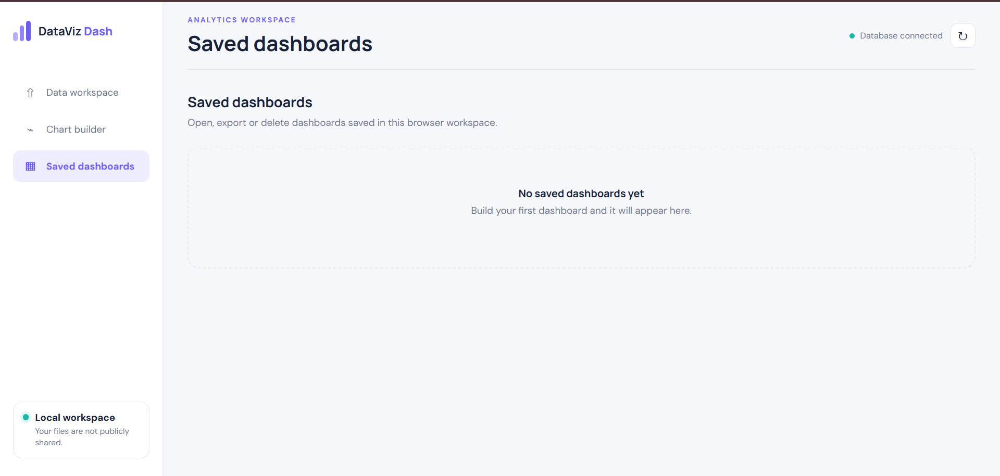

# DataViz Dash

DataViz Dash is a spreadsheet analysis workspace for transforming CSV and Excel
files into clean datasets and interactive dashboards. It brings data upload,
previewing, cleaning, chart creation, dashboard persistence, and export tools
into one focused interface.

The project supports anonymous browser workspaces as well as email/password
accounts for persistent access. It uses MongoDB for dataset and dashboard
storage, Pandas for tabular processing, and Plotly for interactive charts.

## Product preview

### Data workspace

Upload CSV, XLS, or XLSX data, inspect its structure, apply cleaning rules, and
download the prepared dataset.

### Interactive chart builder

Create responsive bar, line, area, pie, scatter, and histogram visualisations.
Dashboards can combine multiple charts from the selected dataset.

### Saved dashboards

Keep dashboards attached to the current browser workspace or registered account,
then reopen, update, export, or delete them when needed.

## Core capabilities

- CSV, XLS, and XLSX upload and preview
- Column renaming and removal
- Missing-value replacement or incomplete-row deletion
- Duplicate and completely empty row removal
- Cleaned CSV download
- Bar, line, area, pie, scatter, and histogram charts
- Multi-chart dashboard creation and persistence
- Dedicated full-screen builder with charts, KPI cards, data tables, and field profiles
- Per-visual sorting, Top-N limits, editing, duplication, and responsive sizing
- Persistent category, numeric-range, date-range, and missing-value dashboard filters
- Month, quarter, and year grouping for date-based visuals
- Chart PNG, dashboard JSON, and print-ready PDF exports
- Anonymous browser-isolated workspaces
- Email/password accounts with persistent workspace ownership
- Server-enforced Free and Pro feature entitlements
- Protected administrator console for account activity, membership, and access control
- Responsive interface for desktop and smaller screens

## Product flow

1. Upload a spreadsheet and review its detected rows and columns.
2. Apply cleaning rules to prepare the dataset for analysis.
3. Select fields and aggregations to create interactive charts.
4. Save the resulting dashboard for future access or export.

## Plans and capacity

| Capability | Free | Pro preview |
| --- | ---: | ---: |
| Maximum upload | 10 MB | 50 MB |
| Rows per dataset | 10,000 | 50,000 |
| Saved datasets | 3 | 25 |
| Saved dashboards | 2 | 25 |
| Charts per dashboard | 4 | 8 |
| Chart data processed | 10,000 rows | 50,000 rows |
| Basic data cleaning | Included | Included |
| Cleaned CSV and chart PNG | Included | Included |
| Dashboard JSON and print / PDF | Upgrade required | Included |

Pro access is currently a product preview. Live payment checkout has not been
enabled yet.

## Technology

| Layer | Technology |
| --- | --- |
| Application | Python and Flask |
| Data processing | Pandas, OpenPyXL, and xlrd |
| Database | MongoDB and PyMongo |
| Visualisation | Plotly.js |
| Interface | HTML, CSS, and JavaScript |
| Quality | Pytest, Ruff, and GitHub Actions |
| Packaging | Docker and GitHub Container Registry workflow-ready |

## Privacy and access

- Uploaded datasets are never given public share links.
- Anonymous data is isolated through a signed browser workspace identifier.
- Registered users can claim an anonymous workspace and access it after signing in.
- Passwords are stored as secure hashes rather than plaintext.
- Plan limits are checked by the server instead of relying only on hidden controls.
- Administrative membership and suspension changes are written to an audit trail.

## Project status

DataViz Dash is under active development. Version `V 0.1` established the
working data-cleaning and dashboard MVP. The current development branch adds
larger dataset capacity, accounts, Free/Pro entitlements, and a staged paywall.

See the [V 0.1 release](https://github.com/Naman794/DataViz-Dash/releases/tag/v0.1)
and the [freemium product plan](docs/FREEMIUM_PLAN.md).

## License

Licensed under the [Apache License 2.0](LICENSE).
